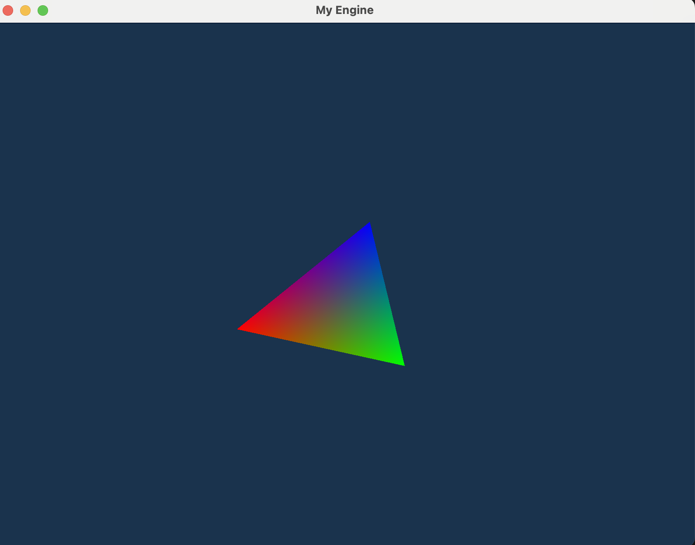
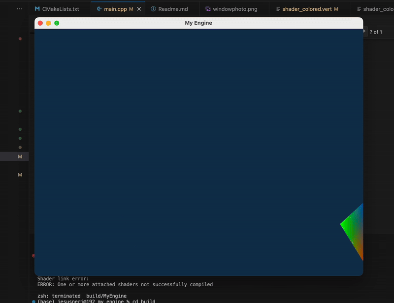
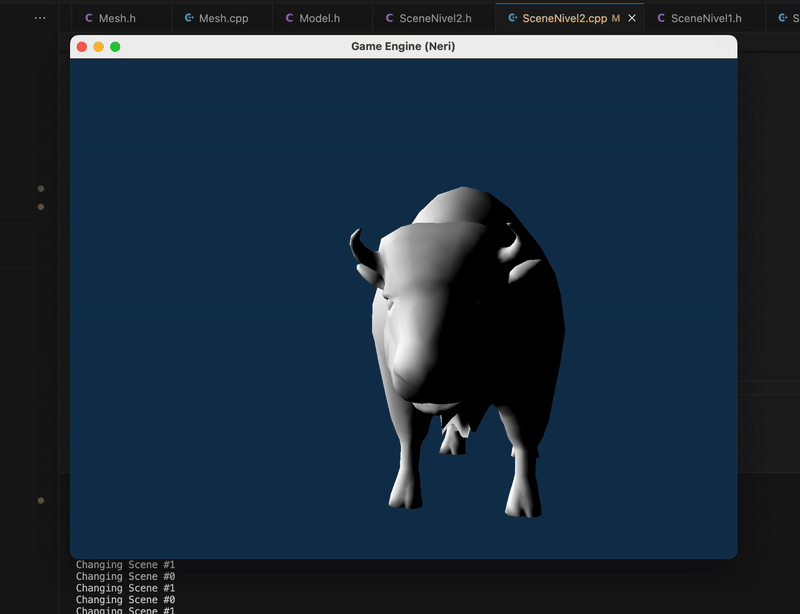
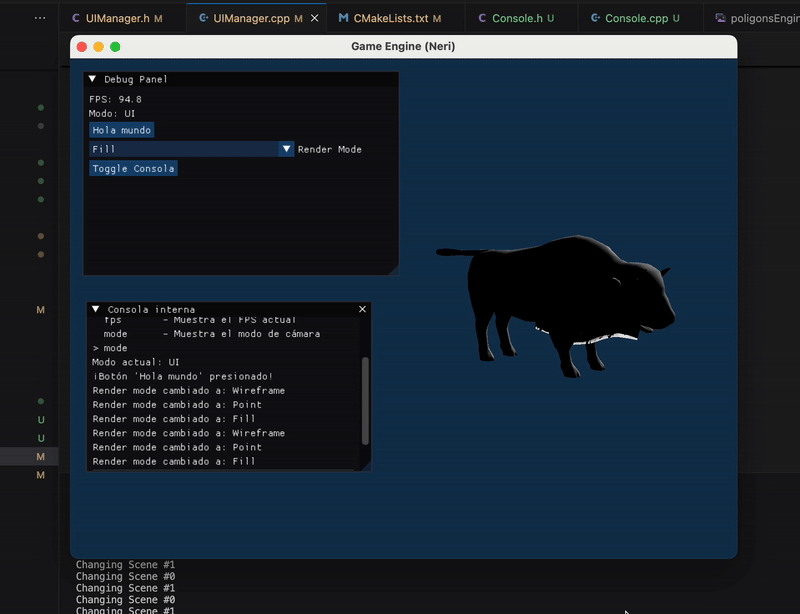

# 🧹 MyEngine

A clean and modular C++ graphics engine template using **OpenGL**, **GLFW**, **GLAD**, and **GLM**.  
Currently renders a colored 3D model with transformation via matrix operations.

[](https://deepwiki.com/jesusneri1024/myengine)

## 📸 Screenshots

  
  




## 🚀 Features

- 🔷 Window and input with [GLFW](https://www.glfw.org/)
- ✨ Rendering using **OpenGL 4.1 Core Profile**
- ⚡ OpenGL function loading via [GLAD](https://glad.dav1d.de/)
- 🎨 Custom shaders (vertex + fragment)
- 🧮 Matrix operations via [GLM](https://github.com/g-truc/glm)
- 🧱 Organized modular codebase with **CMake**
- 📦 3D model loading support via [ASSIMP](https://github.com/assimp/assimp)

## 💠 Project Structure

```
MY_ENGINE
│
├── assets                # Models, textures, etc.
├── build                 # CMake build output
├── external              # Third-party libraries (except assimp)
│   ├── glad
│   ├── glfw
│   └── glm
│   └── assimp
├── src
│   ├── Core              # Application, InputManager
│   ├── Graphics          # Camera, Shader
│   ├── Model             # Mesh, Model
│   ├── main.cpp
├── build_and_run.sh      # Build + run script (Linux/macOS)
├── .gitignore
└── CMakeLists.txt
```

## 📥 External Libraries

- ✅ GLFW, GLAD, and GLM are included in `/external`.
- ❌ **ASSIMP is not included due to its size**.  
  Download it manually:

```bash
git clone --branch master https://github.com/assimp/assimp.git external/assimp
```

Then rebuild the project.

---

## 🛠 Build Instructions

### macOS / Linux

```bash
cd build
cmake --build .
cd ..
build/MyEngine
```

Or use the helper script:

```bash
./build_and_run.sh
```

### Windows (Visual Studio)

```bash
mkdir build
cd build
cmake ..
```

Then open the generated `.sln` file in **Visual Studio** and build the solution.

---

## 🧠 How it works

- `Application` handles window, initialization, and main loop.
- `InputManager` processes keyboard/mouse input (FPS style camera).
- `Camera` provides view matrix.
- `Shader` compiles and manages GLSL programs.
- `Model` and `Mesh` use **ASSIMP** to load and draw `.obj` models.
- Uses **VAO/VBO/EBO** for rendering.

---

## 📚 Requirements

- CMake >= 3.10
- C++17
- OpenGL 4.1 compatible GPU
- GLFW, GLAD, GLM (already included)
- [ASSIMP](https://github.com/assimp/assimp) (must be cloned manually)

---
