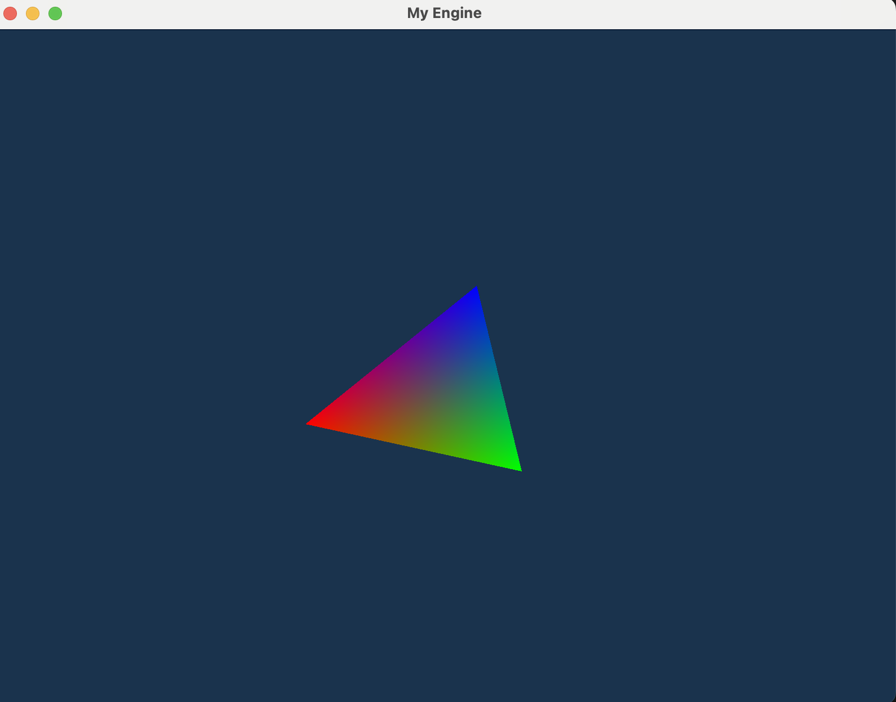
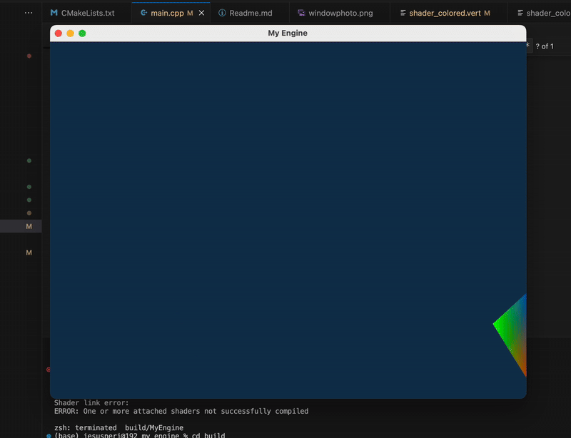

# 🧹 MyEngine

Un proyecto base para motor gráfico en C++ usando OpenGL, GLFW, GLAD y GLM. Actualmente renderiza un triángulo simple con color y transformación por matriz.

[](https://deepwiki.com/jesusneri1024/myengine)

## 📸





## 🚀 Características

- 🔷 Ventana y entrada con [GLFW](https://www.glfw.org/)
- ✨ Renderizado con OpenGL 4.1 (Core Profile)
- ⚡ Carga de funciones OpenGL con [GLAD](https://glad.dav1d.de/)
- 🎨 Shaders personalizados (vertex + fragment)
- 🧮 Transformaciones con matrices usando [GLM](https://github.com/g-truc/glm)
- 🧱 Organización modular con CMake

## 💠 Instalación

### 1. Clona el proyecto

```bash
git clone https://github.com/jesusneri1024/myengine.git
cd myengine
```

### 2. Estructura del proyecto

```
/myengine
│
├── /external
│   ├── /glfw         # Código fuente de GLFW
│   └── /glad         # Archivos generados desde glad.dav1d.de
│   └── /glm
├── /src
│   ├── main.cpp
│   ├── shader.vert
│   └── shader.frag
├── CMakeLists.txt
└── README.md
```

### 3. Construcción (macOS/Linux)

```bash
cd build
cmake --build .
cd ..
build/MyEngine
```

o bien puedes utilizar el script build_and_run.sh

```bash
./build_and_run.sh
```

### 4. Construcción (Windows + MSVC)

Puedes usar CMake con Visual Studio:

```bash
mkdir build
cd build
cmake ..
```

Abre el `.sln` generado y compílalo desde Visual Studio.

---

## 🧠 ¿Cómo funciona?

- `main.cpp` abre una ventana, compila shaders y dibuja un triángulo.
- `shader.vert` aplica transformación con matriz y pasa color al fragment shader.
- `shader.frag` pinta el triángulo interpolando los colores.
- Se usan VAO/VBO para definir y cargar los vértices.

---

## 📚 Requisitos

- CMake >= 3.10
- C++17
- OpenGL 4.1 compatible
- GLAD y GLFW (ya incluidos en `/external`)
- GLM (ya incluidos en `/external`)

---
